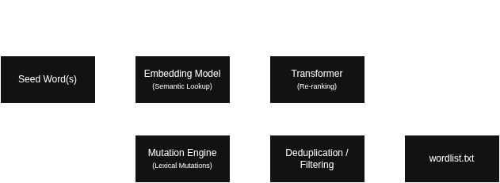

# wl-expand

This is a project aimed at solving the problem (my problem) of on-the-fly wordlist development in penetration testing engagements, red team operations, and other security testing.

Input ("seed") words are mapped to vectors in a high-dimensional space using an embedding model where semantically similar words can be determined by distance. The resulting set of words are optionally used to compute lexical mutations.



## Roadmap

- [ ] Addtl. keyboard layouts (AZERTY, Dvorak, Colemak) for typo mutations
- [ ] Structured filter query language (e.g. luqum) to replace the comma-separated parser rules

## Installation

### pipx (recommended)

```sh
pipx install git+https://github.com/terminalrally/wl-expand.git
```

### pip

```sh
pip install git+https://github.com/terminalrally/wl-expand.git
```

### Development

```sh
git clone https://github.com/terminalrally/wl-expand.git
cd wl-expand
python -m virtualenv .venv
source .venv/bin/activate
pip install -e .
```

First runs with new embedding models will be slow. This is because `gensim` must download, decompress, and convert the model to its native binary format. Subsequent runs using a prior converted model are much faster since this converted file is cached on disk.

## Basic Usage

wl-expand is developed with the intention to produce useful results as simply as possible (KISS) with sane defaults, but provide advanced functionality and tuning for specific needs.

```sh
# Expand a single word
wl-expand password

# Expand multiple words
wl-expand password admin login

# Expand from a seed file
wl-expand seeds.txt

# Save results to a file
wl-expand -o expanded.txt password
```

## Advanced Usage

```sh
# Use Word2Vec instead of FastText, keeping only words longer than 4 chars
wl-expand --embedding-model word2vec -f 'length>4' password

# Get 10 semantic neighbors with a stricter similarity threshold, 50 mutations each
wl-expand -k 10 -s 0.7 -n 50 password admin

# Enable sentence-transformer re-ranking for better contextual results
wl-expand --rerank password

# Re-rank with a specific transformer model
wl-expand --rerank --sentence-transformer mpnet-base-v2 password

# No lexical mutations (leet-speak, typos, suffix mutations)
wl-expand password

# Enable lexical mutations
wl-expand --mutate password

# Filter combinations: words between 5-12 chars that contain "pass"
wl-expand -f 'length>4,length<13,contains=pass' password

# Show verbose output
wl-expand -v -k 5 -s 0.5 password
```

## Concepts

### Semantic Matching

Embedding models (FastText, Word2Vec, GloVe) map words to dense vectors in a high-dimensional space. Words that appear in similar contexts end up close together, so vector distance becomes a proxy for semantic meaning.

Given a seed word like `password`, the embedding model returns its nearest neighbors by cosine similarity:

```
password -> passwords (0.86), passphrase (0.75), login (0.74), credential (0.71) ...
```

Two parameters control this step:

- `-k` / `--top-k` limits how many neighbors are returned (quantity).
- `-s` / `--similarity-threshold` sets a minimum similarity score to keep a candidate (quality).

An optional sentence transformer (`--rerank`) can re-rank these candidates. Embedding models find words that *co-occur* (e.g. `forgot` often appears near `password`) while sentence transformers evaluate actual *semantic equivalence*. Re-ranking demotes contextual noise and promotes genuinely related words - useful for targeted engagements where wordlist precision matters. The model used for re-ranking can be changed with `--sentence-transformer`.

### Lexical Mutation

Enabled with `--mutate`, the mutation engine takes each word (seed + semantic neighbors) and applies rule-based transformations to generate variants that people commonly use in real passwords:

| Mutation Type | Example | Description |
|---|---|---|
| **Leet-speak** | `password` -> `p@55w0rd` | Character substitution (`a->@`, `s->$`, `o->0`, etc.) applied in single and multi-position combinations |
| **Case variants** | `password` -> `Password`, `PASSWORD`, `pASSWORD` | Upper, lower, title, and swapped case |
| **Common suffixes** | `password` -> `password123`, `password!`, `password2026` | Digits, punctuation, and years appended |
| **Common prefixes** | `password` -> `mypassword`, `!password`, `thepassword` | Common words and symbols prepended |
| **Keyboard typos** | `password` -> `oassword`, `psssword` | Single-character replacements using QWERTY-adjacent keys |

These mutations are modeled after real-world patterns found during engagements and in leaks and are complementary to the semantic expansion.

### Deduplication & Filtering

After expansion and mutation, the final wordlist is deduplicated and filtered before output.

Deduplication simply removes duplicates. By default, dedup is case-insensitive - `Password` and `password` are treated as the same word and only the first occurrence is kept. Use `-c` to preserve case distinctions so both survive.

Filtering with `-f` enables you to narrow results using comma-separated rules that are AND-ed together. For example, `-f 'length>4,length<13,contains=pass'` keeps only words between 5-12 characters that contain "pass". Filters are applied after dedup, so the final wordlist only contains words that satisfy every rule. See the [Filter Syntax](#filter-syntax) table for all available rules.

The resulting wordlist is sorted alphabetically and written to stdout (or to a file with `-o`).

## Flags

| Flag | Description | Default |
|---|---|---|
| `-k`, `--top-k` | Number of semantic neighbors to retrieve per seed | `5` |
| `-s`, `--similarity-threshold` | Minimum similarity score (0.0–1.0) | `0.5` |
| `-n`, `--num-words` | Maximum mutation variants per word | `50` |
| `-c`, `--case-sensitive` | Preserve case distinctions during dedup | off |
| `-f`, `--filter` | Comma-separated filter rules | none |
| `-o`, `--output` | Write results to file instead of stdout | stdout |
| `-v`, `--verbose` | Show pipeline details on stderr | off |
| `--embedding-model` | Embedding model: `fasttext`, `word2vec`, `glove` | `fasttext` |
| `--rerank` | Enable sentence-transformer re-ranking of candidates | off |
| `--sentence-transformer` | Re-ranking model: `minilm-l3-v2`, `minilm-l6-v2`, `mpnet-base-v2` | `minilm-l6-v2` |
| `--mutate` | Enable lexical mutations (leet-speak, typos, suffixes) | off |
| `-w`, `--workers` | Number of parallel workers | all CPU cores |

## Filter Syntax

Filters are comma-separated rules passed via `-f`:

| Filter | Example | Description |
|---|---|---|
| `length>N` | `length>4` | Words longer than N characters |
| `length<N` | `length<13` | Words shorter than N characters |
| `length=N` | `length=8` | Words exactly N characters |
| `starts-with=X` | `starts-with=pass` | Words starting with X |
| `ends-with=X` | `ends-with=123` | Words ending with X |
| `contains=X` | `contains=admin` | Words containing X |
| `excludes=X` | `excludes=test` | Words not containing X |